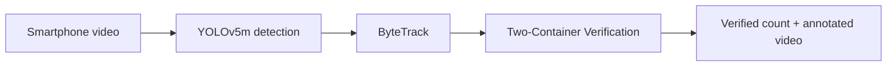

<p align="center">
  
</p>

<h1 align="center">KiwiAI Row Counter</h1>

<p align="center">
  <b>Count visible kiwifruit in one orchard row from a smartphone video.</b><br />
  A practical computer-vision research prototype for structured kiwifruit orchards.
</p>

<p align="center">
  <a href="https://github.com/Amirhossein-hosseini/KiwiAI-Row-Counter"></a>
  <a href="https://github.com/Smart-Ag/kiwifruit_row_counting/tree/main/dataset/images"></a>
  <a href="https://github.com/Amirhossein-hosseini/KiwiAI-Row-Counter/issues"></a>
</p>

---

## 🌱 The idea

Counting fruit from a video is harder than detecting fruit in one photo. The same kiwifruit appears in multiple frames, leaves hide fruit, and neighbouring rows can enter the camera view. KiwiAI is built around a simple goal:

> **Detect fruit → keep its identity across frames → verify its travel → count it once.**

The project is inspired by a row-based smartphone-video counting workflow for structured kiwifruit orchards. It is designed as a transparent local prototype rather than a black-box cloud service.

## ✨ Current capabilities

| Component | Current role |
| --- | --- |
| `YOLOv5m` | Detects `kiwifruit` and `support-post` instances using a custom trained weight. |
| `ByteTrack` | Associates the same detected fruit across consecutive frames. |
| `TCV` | Counts a fruit only after its track passes two virtual verification zones. |
| Desktop app | Lets a Windows user choose a video and `best.pt`, then saves an annotated video. |
| Local labeler | Creates standard YOLO labels for fruit and support posts. |
| Training tools | Selects seed images, audits labels, creates an 80/10/10 split, and starts YOLOv5m training. |

> **Project status:** the software pipeline is available, but this repository intentionally does **not** include trained weights, orchard videos, labels, or a reported accuracy for this implementation. Those require reviewed local data and a proper test set.

## 🧭 Pipeline



The next planned milestone is support-post-guided row-boundary masking to remove fruit from adjacent rows before counting.

## 🔗 Direct links

| Resource | Link |
| --- | --- |
| This repository | [github.com/Amirhossein-hosseini/KiwiAI-Row-Counter](https://github.com/Amirhossein-hosseini/KiwiAI-Row-Counter) |
| Public source images | [Smart-Ag / kiwifruit_row_counting / dataset/images](https://github.com/Smart-Ag/kiwifruit_row_counting/tree/main/dataset/images) |
| Report a bug or request a feature | [Open a GitHub Issue](https://github.com/Amirhossein-hosseini/KiwiAI-Row-Counter/issues) |

## 🚀 Quick start — Windows

```powershell
git clone https://github.com/Amirhossein-hosseini/KiwiAI-Row-Counter.git
cd KiwiAI-Row-Counter

py -3.12 -m venv .venv
.venv\Scripts\Activate.ps1
python -m pip install --upgrade pip
pip install -r requirements.txt

python app.py
```

In the app, select:

1. an upward-looking video recorded while moving along **one orchard row**; and
2. a trained YOLO weight named `best.pt`.

The output is an annotated `*_counted.mp4` video beside the input video.

## 🏷️ Build the training dataset

### 1. Download the public image source

```powershell
cd D:\
git -c http.version=HTTP/1.1 -c http.lowSpeedLimit=0 clone --depth 1 --single-branch https://github.com/Smart-Ag/kiwifruit_row_counting.git KiwiData
```

### 2. Select a diverse 300-image seed set

```powershell
cd path\to\KiwiAI-Row-Counter
python training\select_seed.py D:\KiwiData\dataset\images .\seed
```

### 3. Label the two classes

```powershell
python labeler.py
```

Choose `seed\images` in the app. Draw a box around each instance:

| Keyboard key | Class | What to label |
| --- | --- | --- |
| `1` | `kiwifruit` | Every visible kiwifruit |
| `2` | `support-post` | Each structural support post |
| `Enter` | Save | Save the current image and move to the next one |

The labeler writes normal YOLO `.txt` files into `seed\labels`.

### 4. Audit labels before training

```powershell
python training\audit_labels.py .\seed
```

## 🧠 Train YOLOv5m on an NVIDIA GPU

The baseline matches the paper-oriented settings used by this project:

```text
model     YOLOv5m
input     768 × 768
batch     4
epochs    300
optimizer SGD
schedule  cosine learning rate
lr0       0.001
```

```powershell
python training\make_split.py .\seed .\dataset_split
```

Open `training\kiwifruit.yaml` and replace `DATASET_PATH` with the full path of `dataset_split`. Then run:

```powershell
$env:DATASET_YAML = "$PWD\training\kiwifruit.yaml"
training\train_yolov5m.bat
```

The resulting weight is normally placed under `runs\kiwifruit_yolov5m\weights\best.pt`.

## 🎨 Augmentation policy

Augmentation happens only inside training—not by copying altered images into validation or test sets.

`training/hyp-kiwi.yaml` applies controlled colour, brightness, scale, rotation, translation, and Mosaic augmentation. Vertical flips are intentionally disabled because they would create an unrealistic upward-looking orchard view.

## 📁 Project structure

```text
KiwiAI-Row-Counter/
├── app.py                    # Windows desktop interface
├── analyzer.py               # inference, ByteTrack and TCV
├── labeler.py                # local YOLO annotation tool
├── assets/hero.svg           # README cover artwork
├── training/
│   ├── select_seed.py        # choose 300 seed images
│   ├── audit_labels.py       # validate YOLO labels
│   ├── make_split.py         # 80 / 10 / 10 data split
│   ├── hyp-kiwi.yaml         # training-only augmentation
│   └── train_yolov5m.bat     # GPU training command
└── tests/test_tcv.py         # TCV unit test
```

## ⚠️ Important limitations

- This is not yet a production yield-estimation system.
- Dense fruit clusters, leaf occlusion, motion blur, sudden exposure changes, unstable camera travel, and very wide rows can reduce accuracy.
- Fruit count is **not tonnage**. Estimating tonnes requires calibration using local fruit mass and harvest measurements.
- Do not expect a model trained on this data to work reliably in every orchard or from arbitrary camera angles without validation.

## 🔒 Data policy

Do not commit raw orchard videos, personal data, annotations, trained `.pt` weights, or datasets unless you have explicit permission to publish them. The public image dataset above belongs to its original source; link to it rather than uploading a duplicate.

## 📌 Reference

The method is inspired by a 2025 *Computers and Electronics in Agriculture* study by Zhang *et al.* on row-based kiwifruit counting from smartphone video. This repository is an independent implementation and is not the authors’ official code release.

## 📄 License

No license has been selected yet. Until a license is added, all rights remain reserved by the repository owner.
