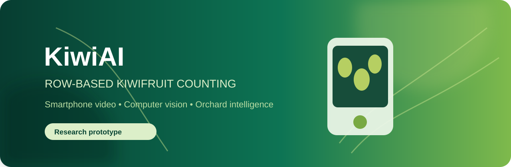

<p align="center"></p>

<h1 align="center">KiwiAI Row Counter</h1>

<p align="center">
  
  
  
</p>

<p align="center"><b>From a smartphone video to a verified, row-wise kiwifruit count.</b></p>

---

> A local research prototype for counting kiwifruit in a **single orchard row** from smartphone video.

KiwiAI is being developed for structured kiwifruit orchards where growers need a faster, repeatable estimate of visible fruit per row. The project combines object detection, multi-object tracking, and a verification step designed to avoid counting the same fruit twice.

## What it does today

- Loads a local smartphone video through a simple Windows desktop interface.
- Uses a custom YOLO weight to detect `kiwifruit` and `support-post` objects.
- Associates fruit across frames with ByteTrack.
- Counts a track only after it passes two virtual zones (**Two-Container Verification / TCV**).
- Saves an annotated output video and the verified count.
- Includes a local labeler, label audit, seed-image selector, and YOLOv5m training configuration.

> **Current status — research prototype.** This repository does not ship a trained weight, orchard videos, or labels. A count is meaningful only after training and evaluation on reviewed orchard data.

## Why row-based counting?

An ordinary detector can see fruit from adjacent rows and can repeatedly assign new IDs to one fruit as the camera moves. KiwiAI addresses the second issue with tracking + TCV. The planned next component uses detected support posts to estimate row boundaries and mask neighbouring-row fruit.

```text
Smartphone video → YOLO detection → ByteTrack → TCV → verified count
```

## Quick start (Windows)

```powershell
git clone https://github.com/Amirhossein-hosseini/KiwiAI-Row-Counter.git
cd KiwiAI-Row-Counter
py -3.12 -m venv .venv
.venv\Scripts\Activate.ps1
python -m pip install --upgrade pip
pip install -r requirements.txt
python app.py
```

Select one upward-looking video of one orchard row and a trained `best.pt` model. The program writes an annotated `*_counted.mp4` video beside the source video.

## Dataset and annotation

| ID | Class | Label it as |
| ---: | --- | --- |
| 0 | `kiwifruit` | Each visible fruit |
| 1 | `support-post` | Each structural support post |

Create a diverse 300-image seed set from the public source images:

```powershell
python training\select_seed.py D:\KiwiData\dataset\images .\seed
python labeler.py
```

In the labeler choose `seed\images`; press `1` for kiwifruit, `2` for support-post, draw a box, and press `Enter` to save. Labels are saved as standard YOLO text files in `seed\labels`.

Before training, validate the labels:

```powershell
python training\audit_labels.py .\seed
```

## Training baseline

The baseline follows the paper settings: **YOLOv5m**, `768×768`, batch size `4`, `300` epochs, SGD, cosine learning-rate schedule, and initial learning rate `0.001`.

```powershell
python training\make_split.py .\seed .\dataset_split
# edit training\kiwifruit.yaml: replace DATASET_PATH with the absolute dataset_split path
$env:DATASET_YAML = "$PWD\training\kiwifruit.yaml"
training\train_yolov5m.bat
```

Augmentation is applied **only to training images** through `training/hyp-kiwi.yaml`; validation and test images stay untouched. The current configuration uses light geometric and colour changes plus Mosaic, while avoiding vertical flips that would make an unrealistic upward-looking orchard view.

## Project layout

```text
KiwiAI-Row-Counter/
├── app.py                    # desktop interface
├── analyzer.py               # video inference, ByteTrack, TCV
├── labeler.py                # local YOLO annotation utility
├── training/                 # dataset, audit and training scripts
└── tests/                    # unit tests
```

## Limitations and next steps

- The current code needs a reviewed, trained model before it can produce a real orchard count.
- Dense clusters, leaves, motion blur, exposure changes, and unstable camera travel can reduce accuracy.
- Support-post-based row-boundary masking is the next implementation milestone.
- Yield or tonnage estimation is **not** implemented: fruit count must first be calibrated with local average fruit mass and harvest measurements.

## Data policy

Do not commit orchard videos, raw datasets, annotations, trained `.pt` weights, or personal data unless you have explicit rights to publish them. The `.gitignore` is intended to keep those files local.

## Reference

Inspired by the row-based smartphone-video kiwifruit-counting workflow described by Zhang *et al.* in *Computers and Electronics in Agriculture* (2025), combining YOLO detection, multi-object tracking, two-container verification, and support-post-guided row handling.

## License

No license has been selected yet. Until a license is added, do not assume permission to reuse the source code.
